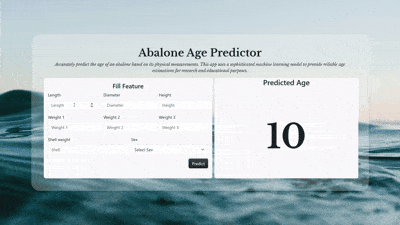
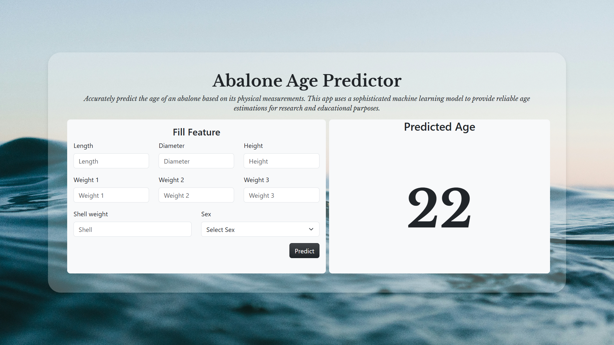

# Abalone Age Prediction

This repository contains code and resources for training and deploying a machine learning model to predict the age of abalones based on various 
features.

##### Demo Video:

[](static/videos/app_demo_video_dummy.mp4)

##### Screenshot of the Web App




Click above to view the demo of the Flask app.

## Project Structure

+ data/
    - train.csv
    - test.csv
+ research/
    - EDA.ipynb
    - Regression_model.ipynb
+ submission/
    - submission.csv
+ trained_models/
    - stored_models.pkl
+ app/
    - app.py
    - templates/
    - static/
        - images/
        - videos/

- **data/**: Contains the training and testing datasets in CSV format.
  - `train.csv`: Training dataset containing features and labels.
  - `test.csv`: Testing dataset containing only features (used for model evaluation).
  
- **research/**: Contains Jupyter notebooks for exploratory data analysis (EDA) and model development.
  - `EDA.ipynb`: Jupyter notebook for exploratory data analysis.
  - `Regression_model.ipynb`: Jupyter notebook for building and evaluating regression models.
  
- **submission/**: Contains the submission file for the Kaggle competition.
  - `submission.csv`: CSV file format for submitting predictions to the Kaggle competition.

- **trained_models/**: Contains the stored models for future use.

- **app/**: Contains the Flask web application for deploying the model.
  - `app.py`: Main Flask application to serve the model.
  - `templates/`: HTML templates for the app.
  - `static/`: Contains static files like images and videos.

## Kaggle Competition
The goal of this project is to predict the age of abalones accurately. The submission file (`submission.csv`) is formatted according to the requirements of the Kaggle competition.

## Dependencies
- Python 3.x
- Jupyter Notebook
- Pandas
- NumPy
- Scikit-learn
- lightGBM
- Flask
- Gunicorn (for production deployment)

## Setup and Usage

### 1. Clone this repository
```bash
git clone https://github.com/yourusername/abalone-age-prediction.git
```

### 2. Navigate to the project directory
```bash
cd abalone-age-prediction
```

### 3. Install dependencies
```bash
pip install -r requirements.txt
```

### 4. Explore the notebooks
- Explore the notebooks in the `research/` directory to understand the data and model development process.
  - `EDA.ipynb`: Perform exploratory data analysis on the dataset.
  - `Regression_model.ipynb`: Build and evaluate regression models for predicting abalone age.

### 5. Train your model
- Run the `Regression_model.ipynb` to train your model using the available training data.

### 6. Save your trained model
- The trained model will be saved in the `trained_models/` directory as `stored_models.pkl`.

### 7. Run the Flask app to deploy the model
- Navigate to the `app/` directory.
- Run the Flask application with the following command:
  ```bash
  flask run
  ```
  This will start the web server, and you can access the app at `http://127.0.0.1:5000/`.

### 8. Web Application
- The web app allows users to input features (like Length, Diameter, Weight, etc.) of abalones and get a prediction of their age.
- The app uses the trained model to predict the age based on user input.

### 9. Create a submission file
- After running the model and generating predictions, create the submission file (`submission.csv`) in the required format for the Kaggle competition.

### 10. Submit your predictions to Kaggle
- Follow the guidelines provided in the competition for submitting your predictions.


## License
This project is licensed under the MIT License - see the [LICENSE](LICENSE) file for details.